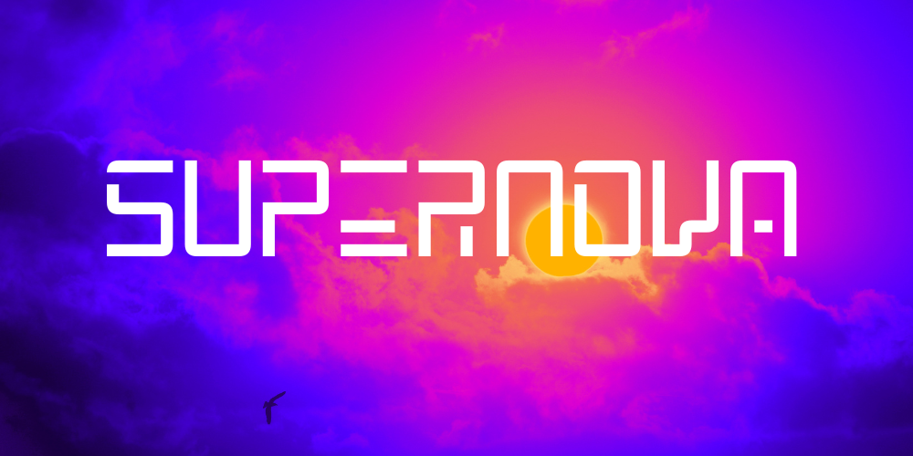

# Supernova



This website is an RSVP website for a YSWS (You Ship, We Ship) draft for the hackclub organisation called **Supernova**. 

Supernova is all about space. You can build projects like satellites, rovers, amateur rockets, orbital mechanics, cosmic simulators etc. The idea behind this YSWS is so that people interested in the universe can share their interests and have a placet to show their projects with prizes that they love.

## How can I Join?

This website is the code for [Supernova RSVP Website](https://supernova-rsvp.vercel.app) where you can RSVP to the event. The more RSVPs we get the higher chance of us getting a sponsor, the more likely YOU can join us and start making awesome projects. If you are an official member of hackclub you can join us at #supernova-ysws, #supernova-ysws-help and #supernova-bulletin

## Tech-Stack

This website uses simple HTML, CSS and JS to handle everything. For creating animations like ```stomp``` and ```typewriter``` I used css classes which activate once a JS Intersection Observer catches that you have scrolled to a particular section.

The page is designed to be responsive using measurements like ```vh```, ```vw,``` and ```rem``` to dynamically change sizes for boxes and text. 

## The Art-Work

The Art-work was created using Canva, mixing together a bunch of nebulas and finding images of interstellar space online and converting them to watercolour illustrations (which is the decided aesthetic for Supernova). 

The font used is called Intro Rust and is the Baseline2 Version of it. I use this font for a lot of my projects including my portfolio.

## What is Hackclub?

Hack Club is a 501(c)(3) nonprofit and network of 60k+ technical high schoolers. We believe you learn best by building, so we’re creating community and providing grants so you can make awesome projects. Go to [Hackclub's Website](https://hackclub.com) to know more.
